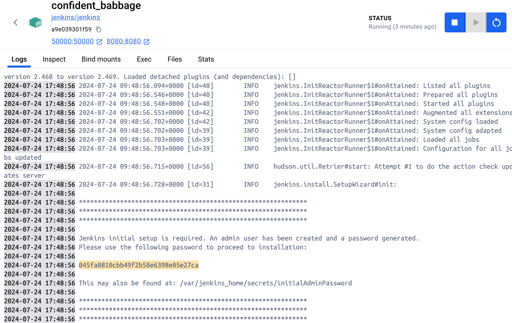

本文将介绍如果在 Docker 容器中安装 Jenkins，并实现 `jenkins` + `k8s`构建 CI/CD 流水线。

## 安装

下载 Jenkins，并实现 镜像，并且运行在 Docker 容器中。

建议使用的 Docker 镜像是 `jenkinsci/blueocean` (来自 the Docker Hub repository)。 该镜像包含当前的长期支持 (LTS) 的 Jenkins 版本（可以投入使用），捆绑了所有 Blue Ocean 插件和功能。这意味着你不需要单独安装 Blue Ocean 插件。

<font style="color:red;">但是 `jenkinsci/blueocean` 镜像貌似不支持arm64架构的Mac，我换成了普通的镜像。</font>
```bash
# 拉取镜像 版本号为 2.454
docker pull jenkins/jenkins:2.454-jdk11

# 运行
# -u root 获取root权限\
# --privileged 给予更多权限
# -d 在后台运行容器（即“分离”模式）并输出容器ID
# -p 8082:8080 容器的端口8080到主机上的端口8082
# -p 50000:50000 容器的端口50000 映射到主机上的端口50000（基于JNLP的Jenkins代理通过TCP端口50000与Jenkins主站进行通信）
# -v jenkins-jdk11-data:/var/jenkins_home （可选，但强烈建议）映射容器中的 `/var/jenkins_home` 目录到具有名字 `jenkins-jdk11-data` 的 volume。 如果这个卷不存在，那么这个 `docker run` 命令会自动为你创建卷。如果您希望每次重新启动Jenkins（通过此 `docker run ...` 命令）时保持 Jenkins 状态，则此选项是必需的。如果你没有指定这个选项，在容器被移除时容器中的数据会丢失。
# -v /var/run/docker.sock:/var/run/docker.sock -v $(which docker):/usr/bin/docker 使用宿主机的docker，通过 `which docker` 查询宿主机安装路径
# -v /etc/localtime:/etc/localtime 让容器使用和服务器同样的时间设置
# -v /Users/ycl/Desktop/soft/apache-maven-3.6.1:/usr/local/maven3.6.1，映射宿主机的maven到容器/usr/local/maven3.6.1，需要将宿主机目录在Docker中配置文件共享，这样Jenkins就可以使用宿主机的Maven
# --name jenkins-jdk11 给容器起一个别名
docker run -u root --privileged -d -p 8082:8080 -p 50000:50000 -v jenkins-jdk11-data:/var/jenkins_home -v /var/run/docker.sock:/var/run/docker.sock -v $(which docker):/usr/bin/docker -v /etc/localtime:/etc/localtime -v /Users/ycl/Desktop/soft/apache-maven-3.6.1:/usr/local/maven3.6.1 --name jenkins-jdk11 jenkins/jenkins:2.454-jdk11

docker run -u root -d -p 8082:8080 -p 50000:50000 -v jenkins-jdk11-data:/var/jenkins_home -e DOCKER_HOST=tcp://dind:2375 -e DOCKER_API_VERSION=1.46 -v /etc/localtime:/etc/localtime -v /Users/ycl/Desktop/soft/apache-maven-3.6.1:/usr/local/maven3.6.1 --name jenkins-jdk11 jenkins/jenkins:2.454-jdk11
```

启动后会在控制台打印管理员密码，进入管理台输入密码配置向导，地址：[http://localhost:8082](http://localhost:8082)


## 插件配置

点击安装推荐的插件，建议开启VPN。如果没有VPN，需要替换成国内的插件源地址。

另外，我们部署项目在`k8s`中，所以需要配置 `k8s` 的插件。在可用插件Available plugins中搜索 `Kubernetes`，点击安装。

安装插件后重启一下。

## 全局工具配置

新增Maven，Maven路径填写 `/usr/local/maven3.6.1`。由于我们在Docker中部署的Jekins，没有配置Maven环境变量，需要在容器中做一个软连接（重启容器需要重新设置）。
```
# 添加软链接
ln -s /usr/local/maven3.6.1/bin/mvn /usr/bin/mvn

# 在docker容器中验证
mvn -v
```

## 添加凭据

在Jenkins管理台，点击 `系统管理` -> `凭据` -> `全局凭据` -> `Add Credentials`，添加凭据。

### Github凭证

使用以下命令生成：
```
# 生成秘钥
ssh-keygen -t rsa -C "258532431@qq.com"
```

生成的秘钥在路径：`/Users/ycl/.ssh`，秘钥ID为 `github-ssh`，复制 `id_rsa` 文件内容到Jenkins Private Key，复制 `id_rsa.pub` 内容到 Github 对应的项目，在 `Setttings -> Deploy keys`。

如果连接Github出现错误：<font style="color:red">No ED25519 host key is known for github.com and you have requested strict checking</font>，修改一下 `系统管理 -> 全局安全配置 -> Git Host Key Verification Configuration`，选择 `No verification`。勾选 `启用代理兼容`。

### K8s凭证

在[kubernetes]章节中，我们制作了了 `ca.crt`、`client.crt`、`client.key` 这几个凭证，现在用它们在生成 Jenkins 凭证。
```
# 生成 cert.pfx 注意需要输入密码 123456（提示密码太短可忽略）
openssl pkcs12 -export -out cert.pfx -inkey client.key -in client.crt -certfile ca.crt
```
在 `系统管理 -> 凭证` ，点击“全局”，添加一个“Certificate”凭证，名称为 `k8s`，将生成的 `cert.pfx` 上传，输入刚刚设置的密码，点击保存。

在 `系统管理 -> Cloud -> New cloud` 中新增 `Kubernetes` 凭证，并输入以下内容：
- 名称：local kubernetes
- Kubernetes URL：输入 `https://kubernetes.docker.internal:6443`（因为 Jenkins 也部署在 Docker 中，所以这里不能用 `https://localhost:6443`）
- Kubernetes 服务证书 key：输入 `ca.crt` 内容
- 禁用Https验证：勾选
- Kubernetes 命名空间：dev
- 凭据：选择刚刚创建的凭证 k8s
- 点击连接测试，显示 `Connected to Kubernetes v1.29.2`

## 创建流水线任务

我们需要编写一个流水线任务脚本
```
# Pipeline script
pipeline {
    agent any
    stages {
        stage('检出代码') {
            steps {
                git branch: 'main', credentialsId: 'github-ssh', url: 'git@github.com:258532431/website_api.git'
            }
        }
        stage('编译打包') {
            steps {
                sh 'mvn clean install -DskipTests -P prod'
            }
        }
        stage('构建Docker镜像') {
            steps {
                sh 'docker build -t yang258532/website_api .'
                sh 'docker tag yang258532/website_api yang258532/website_api:1.0.0'
            }
        }
        stage('部署镜像到k8s') {
            steps {
                withKubeConfig(credentialsId: 'k8s', serverUrl: 'https://kubernetes.docker.internal:6443') {
                    // 取出文件
                    unstash("website_api-deployment.yaml")
                    sh 'kubectl apply -f website_api-deployment.yaml'
                }
            }
        }
    }
}
```