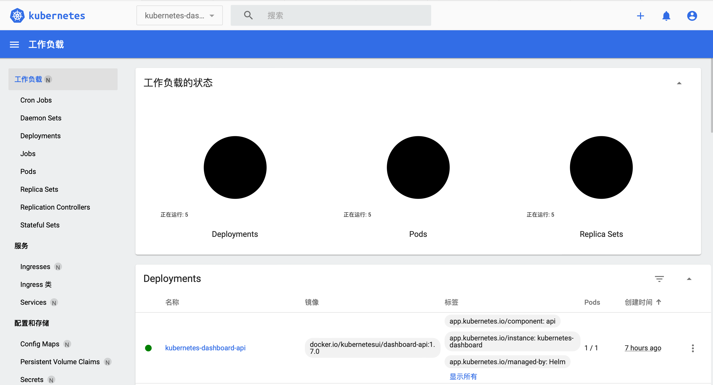
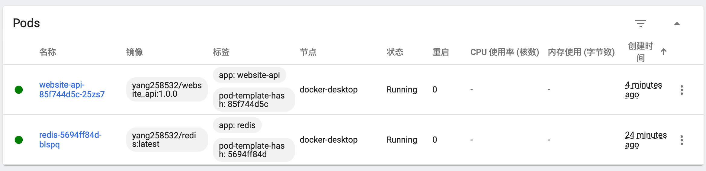
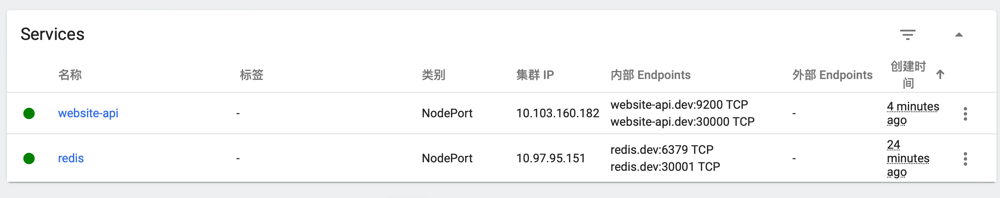
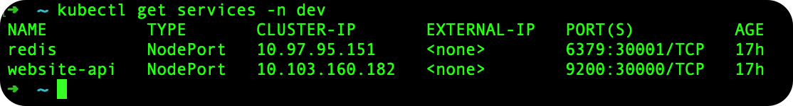

我们已经学会了使用 Docker Compose 来管理我们的应用程序，但是如果我们想要在 Kubernetes 上运行我们的应用程序呢？

容器化有效地保证您的应用程序在任何地方以相同的方式运行，使您能够快速轻松地利用所有这些环境。此外，当您扩展应用程序时，您需要一些工具来帮助自动维护这些应用程序，自动替换失败的容器，并管理这些容器在其生命周期内更新。

## 安装

Mac Docker Desktop 安装 Kubernetes。

1. 从Docker仪表板，导航到设置，然后选择Kubernetes选项卡。

2. 选择标有Enable Kubernetes的复选框，然后选择Apply & Restart。Docker Desktop会自动为您设置Kubernetes。当您在“设置”中看到“Kubernetes正在运行”旁边的绿灯时，您就会知道Kubernetes已成功启用。

!!! note "注意"
    如果使用最新版，请不要使用国内的镜像仓库，否则会找不到版本。使用默认的镜像仓库，请打开VPN，否则会下载失败。

3. 要确认Kubernetes已启动并运行，请创建一个名为pod.yaml的文本文件，其中包含以下内容：
```yaml
apiVersion: v1
kind: Pod
metadata:
  name: demo
spec:
  containers:
  - name: testpod
    image: alpine:latest
    command: ["ping", "8.8.8.8"]
```
这描述了一个带有单个容器的pod，将一个简单的ping隔离到8.8.8.8。

4. 在终端中，导航到您创建pod.yaml的位置并创建您的pod：
```bash
## 创建pod
kubectl apply -f pod.yaml

## 查看pod
kubectl get pods

## 测试
kubectl logs demo

## 删除pod
kubectl delete -f pod.yaml
```

## 启用仪表盘

Kubernetes仪表板目前仅支持基于Helm的安装，因为它速度更快，并使我们能够更好地控制仪表板运行所需的所有依赖项。

如果你还没有安装 Helm，可以使用 `brew` 进行安装：```brew install helm```

```bash
# Add kubernetes-dashboard repository
helm repo add kubernetes-dashboard https://kubernetes.github.io/dashboard/

# Deploy a Helm Release named "kubernetes-dashboard" using the kubernetes-dashboard chart
helm upgrade --install kubernetes-dashboard kubernetes-dashboard/kubernetes-dashboard --create-namespace --namespace kubernetes-dashboard
```

安装完成后，我们需要配置一下访问权限，以便我们能够访问到 Kubernetes Dashboard。使用Kubernetes的服务帐户机制创建新用户，授予此用户管理员权限，并使用与该用户绑定的无记名令牌登录仪表板。

我们正在首先在命名空间kubernetes-dashboard创建名为admin-user的服务帐户。
```bash title="dashboard-adminuser.yaml"
apiVersion: v1
kind: ServiceAccount
metadata:
  name: admin-user
  namespace: kubernetes-dashboard
```

现在我们需要找到可用于登录的令牌。执行以下命令：
```
# 创建admin-user
kubectl apply -f dashboard-adminuser.yaml

# 获取token
kubectl -n kubernetes-dashboard create token admin-user
```

它应该打印以下内容：
```
eyJhbGciOiJSUzI1NiIsImtpZCI6IiJ9.eyJpc3MiOiJrdWJlcm5ldGVzL3NlcnZpY2VhY2NvdW50Iiwia3ViZXJuZXRlcy5pby9zZXJ2aWNlYWNjb3VudC9uYW1lc3BhY2UiOiJrdWJlcm5ldGVzLWRhc2hib2FyZCIsImt1YmVybmV0ZXMuaW8vc2VydmljZWFjY291bnQvc2VjcmV0Lm5hbWUiOiJhZG1pbi11c2VyLXRva2VuLXY1N253Iiwia3ViZXJuZXRlcy5pby9zZXJ2aWNlYWNjb3VudC9zZXJ2aWNlLWFjY291bnQubmFtZSI6ImFkbWluLXVzZXIiLCJrdWJlcm5ldGVzLmlvL3NlcnZpY2VhY2NvdW50L3NlcnZpY2UtYWNjb3VudC51aWQiOiIwMzAzMjQzYy00MDQwLTRhNTgtOGE0Ny04NDllZTliYTc5YzEiLCJzdWIiOiJzeXN0ZW06c2VydmljZWFjY291bnQ6a3ViZXJuZXRlcy1kYXNoYm9hcmQ6YWRtaW4tdXNlciJ9.Z2JrQlitASVwWbc-s6deLRFVk5DWD3P_vjUFXsqVSY10pbjFLG4njoZwh8p3tLxnX_VBsr7_6bwxhWSYChp9hwxznemD5x5HLtjb16kI9Z7yFWLtohzkTwuFbqmQaMoget_nYcQBUC5fDmBHRfFvNKePh_vSSb2h_aYXa8GV5AcfPQpY7r461itme1EXHQJqv-SN-zUnguDguCTjD80pFZ_CmnSE1z9QdMHPB8hoB4V68gtswR1VLa6mSYdgPwCHauuOobojALSaMc3RH7MmFUumAgguhqAkX3Omqd3rJbYOMRuMjhANqd08piDC3aIabINX6gP5-Tuuw2svnV6NYQ
```

为了避免每次登录都需要获取令牌，我们还可以创建一个带有绑定服务帐户的密钥的令牌，令牌将保存在密钥中：
```bash title="dashboard-adminuser-secret.yaml"
apiVersion: v1
kind: Secret
metadata:
  name: admin-user
  namespace: kubernetes-dashboard
  annotations:
    kubernetes.io/service-account.name: "admin-user"   
type: kubernetes.io/service-account-token  
```

创建秘钥后，我们可以执行以下命令来获取保存在秘密中的令牌，方便下次取用：
```
# 创建秘钥
kubectl apply -f dashboard-adminuser-secret.yaml

# 这里获取的token多了一个'%'号，不要复制它（不知道为啥会出现，囧）
kubectl get secret admin-user -n kubernetes-dashboard -o jsonpath={".data.token"} | base64 -d
```

将admin-user权限授权给cluster-admin：
```bash title="dashboard-adminuser-service-account.yaml"
apiVersion: rbac.authorization.k8s.io/v1
kind: ClusterRoleBinding
metadata:
  name: admin-user
roleRef:
  apiGroup: rbac.authorization.k8s.io
  kind: ClusterRole
  name: cluster-admin
subjects:
- kind: ServiceAccount
  name: admin-user
  namespace: kubernetes-dashboard
```

执行命令，为ServiceAccount创建ClusterRoleBinding：
```
kubectl apply -f dashboard-adminuser-service-account.yaml
```

我们已经配置好了，下面可以访问仪表盘了。

如果您基于Helm安装仪表盘，现在访问仪表盘界面，只需运行：
```
kubectl -n kubernetes-dashboard port-forward svc/kubernetes-dashboard-kong-proxy 8443:443
```

现在访问仪表板：[https://localhost:8443](https://localhost:8443)


参考文献：

1. [https://kubernetes.io/docs/tasks/access-application-cluster/web-ui-dashboard/](https://kubernetes.io/docs/tasks/access-application-cluster/web-ui-dashboard/)
2. [https://github.com/kubernetes/dashboard/blob/master/docs/user/accessing-dashboard/README.md](https://github.com/kubernetes/dashboard/blob/master/docs/user/accessing-dashboard/README.md)

## 部署应用

我们现在要部署一个简单的应用，用于测试Kubernetes集群的部署功能。

### 创建命名空间

我们将创建一个开发环境的命名空间，命名空间名称指定为 `dev`，用于测试我们的应用。一般情况下，不同的命名空间其资源是隔离的。

```bash
# 创建dev命名空间
kubectl create namespace dev

# 列出所有的命名空间
kubectl get namespace
```

### 创建Pod和Service

我们需要编写一个配置文件，用于创建一个Deployment资源。Deployment资源是一个用来管理Pod的资源，它允许我们创建和删除Pod，并确保Pod的数量符合我们的需求。

除了Deployment资源，我们还需要创建一个Service资源，用于暴露Deployment的端口。Service资源是一个用来暴露Pod的资源，它允许我们通过一个固定的IP地址和端口来访问Pod。

我们继续使用介绍 Docker 时使用的 `springboot` 项目镜像来进行测试。下面是一个简单的Deployment和Service的配置文件，当配置文件中有多个对象时，需要使用 `---` 分隔开：
```yaml title="website_api-deployment.yaml"
# 解析此对象的Kubernetes API
apiVersion: apps/v1
# Pod的类型，这里指定为Deployment
kind: Deployment
metadata:
  # Deployment的名称
  name: website-api
  # Deployment所属的命名空间
  namespace: dev
spec:
  # 选择器，用于匹配Pods的标签
  selector:
    matchLabels:
      # 必须和 spec.template.metadata.labels 相同
      app: website-api
  # 副本数，即运行的Pod实例数
  replicas: 1
  # Pod准备好之前等待的最短秒数，用于健康检查，在该段时间内，更新操作会被阻塞
  minReadySeconds: 10
  # Pod模板
  template:
    metadata:
      # 标签，用于Selector选择，此处的定义会应用到 spec.template.spec下定义的所有pod副本
      labels:
        app: website-api
    spec:
      # 容器列表
      containers:
      # 容器名称
      - name: website-api
        # 容器镜像
        image: yang258532/website_api:1.0.0
        # 镜像拉取策略 
        # Always：每次启动Pod时都会尝试拉取镜像
        # IfNotPresent：如果本地不存在镜像则拉取，存在则使用本地镜像。如果不指定值，这是默认行为
        # Never：永远不会拉取镜像，只会使用本地镜像
        # imagePullPolicy: Never
        ports:
        # 容器暴露的端口，targetPort映射到containerPort
        - containerPort: 9200
---
apiVersion: v1
kind: Service
metadata:
   name: website-api
   namespace: dev
spec:
   # 服务类型，NodePort表示可以通过Node的IP和指定的端口访问服务
   type: NodePort
   # 选择器，用于选择哪些Pods属于此服
   selector:
      app: website-api
   # 服务端口配置
   ports:
      - name: website-api
        # 其他服务或Pods可以在集群内部通过端口80来访问标记为 app: website_api 的Pods
        port: 80
        # 目标端口，Pods上容器的实际监听端口
        targetPort: 9200
        # 外部访问此服务的端口，必须在30000-32767之间
        nodePort: 30000
```

执行命令：
```
# 创建Deployment和Service
kubectl apply -f website_api-deployment.yaml

# 查看， -n dev 表示指定命名空间为dev
kubectl get deployments -n dev

# 删除
kubectl delete -f website_api-deployment.yaml
```

由于我们的项目依赖redis，所以还需要创建redis的Deployment和Service。
```yaml title="redis-deployment.yaml"
apiVersion: apps/v1
kind: Deployment
metadata:
  name: redis
  namespace: dev
spec:
  selector:
    matchLabels:
      app: redis
  replicas: 1
  minReadySeconds: 5
  template:
    metadata:
      labels:
        app: redis
    spec:
      containers:
      - name: redis
        # 容器镜像
        image: yang258532/redis:latest
        ports:
        # 容器的端口号
        - containerPort: 6379
---
apiVersion: v1
kind: Service
metadata:
   name: redis
   namespace: dev
spec:
   type: NodePort
   selector:
      app: redis
   ports:
      - name: redis
        port: 6379
        targetPort: 6379
        nodePort: 30001
```

### 验证

我们现在登录 k8s dashboard，查看容器运行情况。

Pods运行状态正常。


Services运行状态正常。


查看Service对应的外部IP地址和端口。


通过 `curl` 命令验证 app 接口是否可以正常调用：
```
curl --location 'http://localhost:30000/site/setPv'
```

!!! note "提示"
    由于我们是本地集群部署，所以Service对应的外部IP地址是 `localhost`，端口我们在上面配置的 `nodePort`。